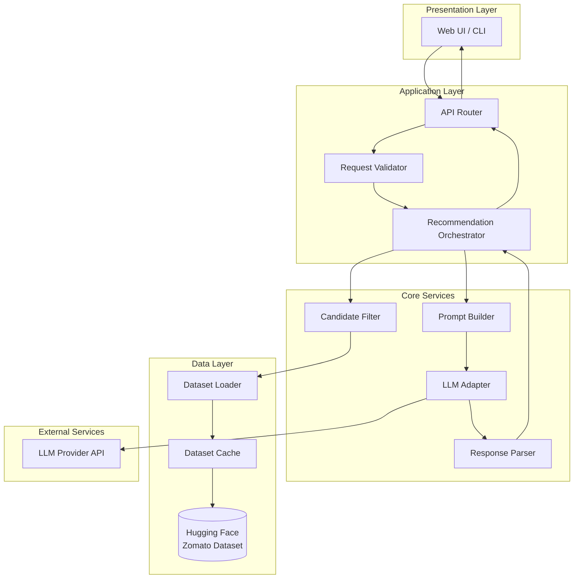
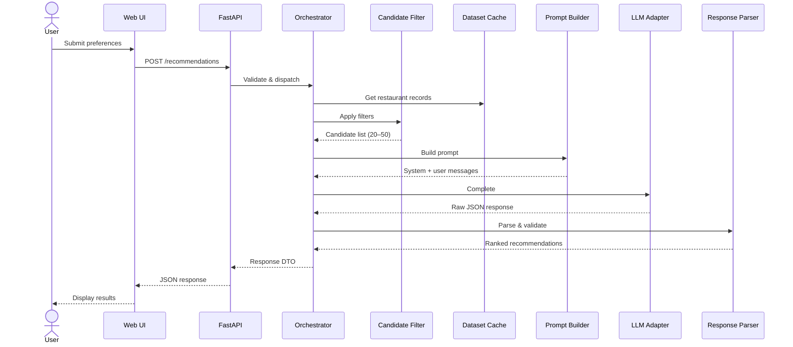
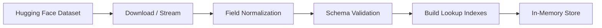
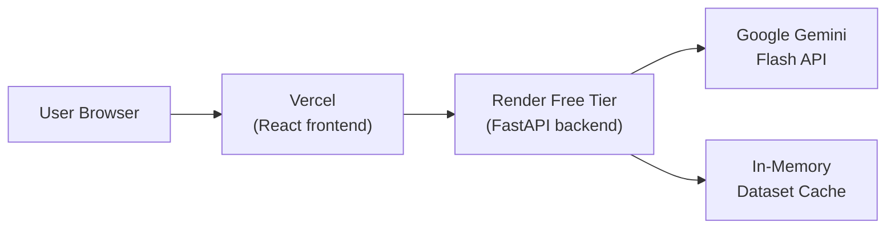

# Architecture: AI-Powered Restaurant Recommendation System

## Document Purpose

This document defines the technical architecture for the Zomato-inspired restaurant recommendation service described in [`context.md`](./context.md). It translates product requirements into concrete components, data flows, interfaces, and implementation guidance.

---

## 1. Architectural Overview

### 1.1 System Summary

The system is a **hybrid retrieval + reasoning pipeline**:

1. **Structured retrieval** narrows a large restaurant dataset to a candidate set using deterministic filters.
2. **LLM reasoning** ranks candidates and generates natural-language explanations tailored to user preferences.

This split keeps LLM context small, reduces cost and latency, and grounds recommendations in real dataset records.

### 1.2 Architectural Principles

| Principle | Rationale |
|-----------|-----------|
| **Grounded recommendations** | Every suggestion must map to a real restaurant record from the dataset — no hallucinated venues. |
| **Filter first, reason second** | Pre-filter with structured rules; use the LLM only for ranking and explanation. |
| **Separation of concerns** | Data ingestion, filtering, prompting, and presentation are independent modules. |
| **Provider-agnostic LLM layer** | Abstract the LLM behind an interface so the model/provider can be swapped. |
| **Progressive enhancement** | Core flow works with minimal inputs; optional free-text preferences enrich results. |

### 1.3 Recommended Stack

| Layer | Recommendation | Notes |
|-------|----------------|-------|
| **Language** | Python 3.11+ | Strong ecosystem for data (`datasets`, `pandas`) and LLM SDKs. |
| **Data loading** | Hugging Face `datasets` | Native support for the Zomato dataset source. |
| **API / backend** | FastAPI | Lightweight, async-friendly, auto-generated OpenAPI docs. |
| **Frontend** | React + Vite + Framer Motion | Production UI with animations and glassmorphism design. |
| **LLM provider** | Google Gemini Flash (free tier) | Fast, free (1,500 RPD), excellent JSON adherence; swappable via adapter. |
| **Config / secrets** | `.env` + `pydantic-settings` | API keys and tunables outside code. |
| **Caching** | In-memory | Dataset cached in memory on startup; no external cache layer. |

---

## 2. High-Level Architecture



---

## 3. Component Architecture

### 3.1 Presentation Layer

**Responsibility:** Collect user preferences and render ranked recommendations.

#### Web UI (recommended)

- Single-page form for structured inputs (location, budget, cuisine, min rating).
- Optional free-text field for additional preferences (e.g., "family-friendly, outdoor seating").
- Results view: cards showing name, cuisine, rating, cost, and AI explanation.
- Loading and error states for LLM latency and validation failures.

#### CLI (optional, for development)

- Same inputs via flags or interactive prompts.
- JSON or table output for scripting and testing.

### 3.2 Application Layer (API)

**Responsibility:** Validate requests, orchestrate the pipeline, return structured responses.

#### Endpoints

| Method | Path | Description |
|--------|------|-------------|
| `GET` | `/health` | Liveness check |
| `GET` | `/metadata/locations` | Distinct locations from dataset (for UI dropdowns) |
| `GET` | `/metadata/cuisines` | Distinct cuisines from dataset |
| `POST` | `/recommendations` | Main recommendation endpoint |

#### `POST /recommendations` Contract

**Request body:**

```json
{
  "location": "Bangalore",
  "budget": "medium",
  "cuisine": "Italian",
  "min_rating": 4.0,
  "additional_preferences": "family-friendly, quick service",
  "top_k": 5
}
```

**Response body:**

```json
{
  "summary": "Based on your preferences in Bangalore...",
  "recommendations": [
    {
      "rank": 1,
      "restaurant_id": "abc123",
      "name": "Trattoria Roma",
      "cuisine": "Italian",
      "rating": 4.5,
      "estimated_cost": "₹800 for two",
      "location": "Indiranagar, Bangalore",
      "explanation": "Highly rated Italian spot within your medium budget..."
    }
  ],
   "metadata": {
     "candidates_considered": 15,
     "model": "gemini-flash-latest",
     "latency_ms": 1200,
     "cuisine_relaxed": false,
     "budget_relaxed": false,
     "llm_fallback": false
   }
}
```

### 3.3 Core Services

#### 3.3.1 Dataset Loader

- Loads the Zomato dataset from Hugging Face on startup (or first request).
- Normalizes field names and types into an internal `Restaurant` schema.
- Caches the processed dataframe in memory to avoid repeated downloads.

**Internal schema (`Restaurant`):**

| Field | Type | Source / Notes |
|-------|------|----------------|
| `id` | string | Generated or from dataset index |
| `name` | string | Restaurant name |
| `location` | string | City / area |
| `cuisine` | string | Primary or comma-separated cuisines |
| `rating` | float \| None | Normalized to 0–5 |
| `cost_for_two` | int \| None | INR; used for budget mapping |
| `rest_type` | string \| None | e.g., "Casual Dining", "Quick Bites" |
| `votes` | int | Number of user votes |
| `dish_liked` | string | Popular dishes |
| `review_snippets` | list[str] | Real customer review excerpts (v2 dataset) |

#### 3.3.2 Candidate Filter

Deterministic pre-LLM filtering. Reduces dataset to a manageable candidate set (target: 10–15 records).

**Filter rules (applied in order):**

1. **Location** — case-insensitive match on city/area field.
2. **Minimum rating** — `rating >= min_rating`.
3. **Cuisine** — substring or token match (handles multi-cuisine labels).
4. **Budget** — map user budget to cost ranges:

   | Budget | Cost for two (INR) |
   |--------|-------------------|
   | `low` | ≤ 500 |
   | `medium` | 501 – 1500 |
   | `high` | > 1500 |

5. **Fallback** — if fewer than `MIN_CANDIDATES` (e.g., 10) remain, relax cuisine filter first, then budget.

**Output:** Ordered list of `Restaurant` objects passed to the prompt builder.

#### 3.3.3 Prompt Builder

Constructs a structured prompt with:

- System instructions (role, constraints, output format).
- User preference summary.
- Candidate restaurant list as JSON (compact, one object per line).
- Explicit instruction to only recommend from the provided list.

**Design constraints embedded in the prompt:**

- Rank top N (default 5) restaurants.
- Explain *why* each fits the stated preferences.
- Optionally produce a one-paragraph summary.
- Return JSON matching the response schema (enables reliable parsing).

#### 3.3.4 LLM Adapter

Abstract interface isolating provider-specific SDK calls.

```python
class LLMClient(Protocol):
    async def complete(self, system: str, user: str) -> str: ...
```

Current implementation: `GeminiClient` (using the `google-genai` SDK). The adapter pattern allows swapping to other providers if needed.

**Configuration:**

- Model name, temperature (low: 0.2–0.4 for consistency), max tokens.
- Timeout and retry with exponential backoff on transient failures.

#### 3.3.5 Response Parser

- Parses LLM JSON output into typed `Recommendation` objects.
- Validates that every recommended `restaurant_id` exists in the candidate set.
- Falls back to rule-based ranking if parsing fails (rating desc, then cost proximity to budget midpoint).

---

## 4. Recommendation Pipeline

### 4.1 End-to-End Sequence



### 4.2 Pipeline Stages

| Stage | Input | Output | Failure mode |
|-------|-------|--------|--------------|
| Validate | Raw HTTP body | `UserPreferences` | 422 validation error |
| Load data | — | In-memory dataset | 503 if dataset unavailable |
| Filter | Preferences + dataset | Candidate list | 404 if zero candidates after fallback |
| Prompt | Preferences + candidates | LLM messages | — |
| LLM call | Messages | Raw text | Retry, then 502 |
| Parse | Raw text + candidates | Ranked list | Fallback ranking |
| Respond | Ranked list | API response | — |

---

## 5. Prompt Architecture

### 5.1 System Prompt (template)

```
You are a restaurant recommendation assistant for an app inspired by Zomato.
You receive a user's preferences and a list of real restaurants from a database.
You must ONLY recommend restaurants from the provided list.
Do not invent restaurants or modify factual fields (name, rating, cost).
Rank the top {top_k} options and explain why each fits the user's preferences.
Return valid JSON matching the specified schema.
```

### 5.2 User Prompt Structure

```
User preferences:
- Location: {location}
- Budget: {budget}
- Cuisine: {cuisine}
- Minimum rating: {min_rating}
- Additional: {additional_preferences}

Candidate restaurants (JSON):
{candidates_json}

Return JSON:
{
  "summary": "...",
  "recommendations": [
    {
      "rank": 1,
      "restaurant_id": "...",
      "explanation": "..."
    }
  ]
}
```

### 5.3 Grounding Strategy

To prevent hallucination:

1. Pass only filtered candidates — never the full dataset.
2. Require `restaurant_id` in LLM output; merge factual fields from the dataset server-side.
3. Reject any LLM-suggested ID not in the candidate set.
4. Keep temperature low for consistent ranking.

---

## 6. Data Architecture

### 6.1 Ingestion Flow



### 6.2 Indexes (in-memory)

Built at load time for fast filtering and metadata endpoints:

- `locations`: unique city/area values
- `cuisines`: unique cuisine tokens (split multi-value fields)
- `by_location`: inverted index for O(1) location lookup

### 6.3 Dataset Reference

| Property | Value |
|----------|-------|
| Name | Zomato Restaurant Recommendation |
| URL | https://huggingface.co/datasets/ManikaSaini/zomato-restaurant-recommendation |
| Refresh | On application startup; optional periodic reload in production |

---

## 7. Proposed Project Structure

```
vibecodingsideprojects/
├── docs/
│   ├── problemstatement.txt
│   ├── context.md
│   ├── Architecture.md
│   └── edge-case.md
├── src/
│   └── restaurant_rec/
│       ├── __init__.py
│       ├── main.py                 # FastAPI app entrypoint + CORS
│       ├── config.py               # Settings (pydantic-settings)
│       ├── models/
│       │   ├── restaurant.py       # Restaurant, UserPreferences DTOs
│       │   └── recommendation.py   # Recommendation response models
│       ├── data/
│       │   ├── loader.py           # v2 JSONL loader + HF fallback
│       │   └── cache.py            # In-memory dataset cache + indexes
│       ├── services/
│       │   ├── filter.py           # Candidate filtering logic
│       │   ├── scoring.py          # Rule-based scoring for fallback
│       │   ├── orchestrator.py     # Pipeline coordinator
│       │   └── metadata.py         # Locations / cuisines endpoints
│       ├── llm/
│       │   ├── client.py           # LLM adapter (GeminiClient)
│       │   ├── prompt_builder.py   # Prompt templates
│       │   └── parser.py           # Response parsing + fallback
│       └── api/
│           ├── routes.py           # FastAPI routers
│           └── dependencies.py     # DI (dataset, LLM client)
├── frontend/                       # React + Vite + Framer Motion UI
│   └── src/
│       ├── App.tsx                 # Main app with form + results
│       ├── api.ts                  # API client layer
│       ├── index.css               # Aurora/glassmorphism design
│       └── components/             # PlaceCard, NeighborhoodPicker
├── data/
│   └── restaurants_v2.jsonl        # Pre-enriched dataset with reviews
├── tests/
│   ├── test_filter.py
│   ├── test_parser.py
│   └── test_api.py
├── .env.example
├── requirements.txt
└── README.md
```

---

## 8. Cross-Cutting Concerns

### 8.1 Error Handling

| Scenario | HTTP Status | User-facing message |
|----------|-------------|---------------------|
| Invalid input | 422 | Field-level validation errors |
| No restaurants match | 404 | "No restaurants found for these preferences. Try relaxing filters." |
| LLM timeout / failure | 502 | "Recommendation service temporarily unavailable." |
| Dataset load failure | 503 | "Restaurant data is unavailable." |

### 8.2 Logging & Observability

- Structured JSON logs per request: `request_id`, filter counts, LLM latency, model name.
- Log prompt token estimates (not full prompts in production if PII concerns arise).
- Metrics: requests/sec, p95 latency, LLM error rate, empty-result rate.

### 8.3 Security

- API keys stored in environment variables, never committed.
- Rate limiting on `/recommendations` to control LLM cost abuse.
- Input sanitization on free-text `additional_preferences` (length cap, no prompt injection patterns logged).
- CORS restricted to known frontend origins in production.

### 8.4 Performance

| Optimization | Approach |
|--------------|----------|
| Dataset load | Load once at startup; keep in memory |
| LLM cost | Pre-filter to ≤50 candidates; use smaller model |
| Response cache | Hash `(location, budget, cuisine, min_rating, additional)` → cache LLM output (TTL: 1h) |
| Async I/O | Async LLM calls via FastAPI |

### 8.5 Testing Strategy

| Layer | Test type | Focus |
|-------|-----------|-------|
| Filter | Unit | Location, budget, cuisine, rating, fallback logic |
| Parser | Unit | Valid JSON, invalid JSON, unknown IDs |
| Prompt builder | Unit | Schema completeness, candidate serialization |
| API | Integration | End-to-end with mocked LLM |
| LLM | Manual / eval | Explanation quality, grounding accuracy |

---

## 9. Deployment Architecture

### 9.1 Development

```
Developer → uvicorn (local) → v2 JSONL dataset + Gemini API
```

### 9.2 Production (current)



- **Frontend:** React static build on **Vercel** ([sakkath-tindi.vercel.app](https://sakkath-tindi.vercel.app)).
- **Backend:** FastAPI on **Render** free tier (0.1 CPU, 512MB RAM). Spins down after 15 min inactivity.
- **Secrets:** `GEMINI_API_KEY` set via Render environment variables.
- **Frontend↔Backend link:** `VITE_API_URL` env var on Vercel points to the Render URL.

---

## 10. Design Decisions (Resolved)

Decisions left open in `context.md`, resolved here:

| Decision | Choice | Rationale |
|----------|--------|-----------|
| LLM provider | Google Gemini Flash (free tier) | Free (1,500 RPD), fast, excellent JSON adherence |
| Application type | FastAPI backend + React frontend | Clean API boundary; deployed separately on Vercel + Render |
| Filtering strategy | Pre-filter before LLM (max 15 candidates) | Controls token usage; grounds results in real data |
| Prompt design | Structured JSON output | Enables reliable parsing and validation |
| Number of recommendations | Default 5 (`top_k` configurable) | Enough variety without overwhelming the user |
| Hallucination prevention | ID-based merge + review snippets | LLM explains using real customer reviews (v2 grounding) |
| Rate-limit resilience | Graceful fallback to rule-based ranking | App never breaks; just loses AI explanations temporarily |

---

## 11. Future Extensions

- **User accounts & history** — Persist past searches and refine recommendations.
- **Geospatial filtering** — Distance-based ranking when lat/long is available.
- **Embeddings retrieval** — Semantic search over `additional_preferences` before LLM ranking.
- **A/B testing** — Compare prompt variants and models on click-through or satisfaction.
- **Batch offline eval** — Benchmark ranking quality against labeled preference sets.

---

## 12. References

- Project context: [`context.md`](./context.md)
- Problem statement: [`problemstatement.txt`](./problemstatement.txt)
- Dataset: [ManikaSaini/zomato-restaurant-recommendation](https://huggingface.co/datasets/ManikaSaini/zomato-restaurant-recommendation)
