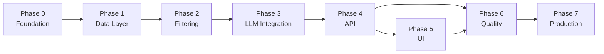

# Phase-Wise Implementation Plan

## Document Purpose

This plan breaks the AI-powered restaurant recommendation system into incremental phases. Each phase delivers a testable milestone and maps directly to requirements in [`context.md`](./context.md) and components defined in [`Architecture.md`](./Architecture.md).

---

## Overview

| Phase | Name | Goal | Est. Duration |
|-------|------|------|---------------|
| 0 | Project Foundation | Repo, tooling, config scaffold | 0.5–1 day |
| 1 | Data Layer | Load, normalize, and cache Zomato dataset | 1–2 days |
| 2 | Filtering & Domain Models | Deterministic candidate retrieval | 1–2 days |
| 3 | LLM Integration | Prompt, adapter, parser, grounding | 2–3 days |
| 4 | API & Orchestration | FastAPI endpoints and full pipeline | 1–2 days |
| 5 | User Interface | Form, results display, error states | 2–3 days |
| 6 | Quality & Hardening | Tests, logging, error handling, polish | 1–2 days |
| 7 | Production Readiness | Caching, deployment, observability | 1–2 days |

**Total estimated timeline:** 10–16 days (single developer, part-time to full-time)

---

## Phase Dependency Graph



Phases 5 and 6 can partially overlap once Phase 4 is stable (API contract frozen).

---

## Success Criteria Mapping

Requirements from `context.md` tracked across phases:

| Success Criterion | Completed In |
|-------------------|--------------|
| Dataset loads and preprocesses from Hugging Face | Phase 1 |
| User can specify location, budget, cuisine, rating, preferences | Phase 4 (API) + Phase 5 (UI) |
| System filters data before LLM processing | Phase 2 |
| LLM ranks restaurants and generates explanations | Phase 3 |
| Results displayed with name, cuisine, rating, cost, explanation | Phase 5 |

---

## Phase 0: Project Foundation

**Goal:** Establish project structure, dependencies, and development workflow so later phases can proceed without rework.

### Tasks

- [ ] Initialize Python project with `src/restaurant_rec/` layout per Architecture §7
- [ ] Create `requirements.txt` with core dependencies:
  - `fastapi`, `uvicorn`, `pydantic`, `pydantic-settings`
  - `datasets`, `pandas`
  - `google-genai` (Gemini LLM SDK)
  - `python-dotenv`, `httpx`
  - Dev: `pytest`, `pytest-asyncio`, `ruff`
- [ ] Add `.env.example` with `GEMINI_API_KEY`, `LLM_MODEL`, `LOG_LEVEL`
- [ ] Add `.gitignore` (`.env`, `__pycache__`, `.venv`, etc.)
- [ ] Create `config.py` using `pydantic-settings` for all tunables
- [ ] Scaffold empty module files (`models/`, `data/`, `services/`, `llm/`, `api/`)
- [ ] Write minimal `README.md` with setup and run instructions

### Deliverables

- Runnable empty FastAPI app with `GET /health` returning `{ "status": "ok" }`
- Project boots via `uvicorn restaurant_rec.main:app --reload`

### Exit Criteria

- [ ] `uvicorn` starts without errors
- [ ] `/health` returns 200
- [ ] Environment variables load from `.env`

---

## Phase 1: Data Layer

**Goal:** Ingest the Zomato dataset from Hugging Face and expose a normalized, in-memory restaurant store.

**Maps to:** Context workflow step 1 (Data Ingestion) · Architecture §3.3.1, §6

### Tasks

- [ ] Implement `data/loader.py`:
  - Load dataset from [Hugging Face](https://huggingface.co/datasets/ManikaSaini/zomato-restaurant-recommendation)
  - Inspect raw schema and map fields to internal `Restaurant` model
  - Normalize types (rating → float, cost → int INR)
  - Assign stable `id` per record
- [ ] Define `models/restaurant.py`:
  - `Restaurant` dataclass/Pydantic model (`id`, `name`, `location`, `cuisine`, `rating`, `cost_for_two`, `raw`)
- [ ] Implement `data/cache.py`:
  - Load dataset once at startup (FastAPI lifespan hook)
  - Hold processed records in memory
  - Expose `get_all()`, `get_by_id()`, `count()`
- [ ] Build lookup indexes at load time:
  - Unique `locations` list
  - Unique `cuisines` list (split multi-value cuisine strings)
  - `by_location` inverted index
- [ ] Add startup logging: record count, load time, sample record

### Deliverables

- Dataset loads on app startup
- Internal `Restaurant` schema populated for all records
- Indexes available for metadata and filtering

### Exit Criteria

- [ ] App starts and logs successful dataset load
- [ ] `get_all()` returns expected record count (> 0)
- [ ] Sample records have valid name, location, cuisine, rating, cost
- [ ] **Context success criterion:** Dataset loads and preprocesses correctly ✓

### Risks & Mitigations

| Risk | Mitigation |
|------|------------|
| Dataset field names differ from docs | Inspect HF dataset card; add flexible column mapping in loader |
| Missing/null ratings or costs | Default or exclude records with critical missing fields; log counts |
| Slow first download | Cache locally after first fetch; document HF cache behavior |

---

## Phase 2: Filtering & Domain Models

**Goal:** Implement deterministic pre-LLM candidate filtering and user preference models.

**Maps to:** Context workflow step 3 (Integration Layer — filter) · Architecture §3.3.2

### Tasks

- [ ] Define `models/restaurant.py` → `UserPreferences`:
  - `location`, `budget` (enum: low/medium/high), `cuisine`, `min_rating`, `additional_preferences` (optional), `top_k` (default 5)
- [ ] Implement `services/filter.py`:
  - Location filter (case-insensitive)
  - Minimum rating filter
  - Cuisine filter (token/substring match)
  - Budget filter (low ≤500, medium 501–1500, high >1500 INR)
  - Fallback: relax cuisine, then budget if `< MIN_CANDIDATES` (10)
  - Cap output at 15 candidates
- [ ] Write unit tests in `tests/test_filter.py`:
  - Each filter rule in isolation
  - Combined filters
  - Fallback behavior
  - Empty result case
- [ ] Add CLI script or temporary endpoint to test filtering without LLM

### Deliverables

- `filter_candidates(preferences, restaurants) -> list[Restaurant]`
- Comprehensive unit test suite for filter logic

### Exit Criteria

- [ ] Filtering returns 20–50 candidates for typical queries (e.g., Bangalore + Italian)
- [ ] Fallback expands results when strict filters yield < 10 matches
- [ ] Zero-match case handled gracefully (empty list, not crash)
- [ ] **Context success criterion:** System filters data based on user input ✓

---

## Phase 3: LLM Integration

**Goal:** Connect the filtered candidate set to an LLM for ranking, explanation, and summary — with grounding guarantees.

**Maps to:** Context workflow steps 3–4 (Integration Layer + Recommendation Engine) · Architecture §3.3.3–§3.3.5, §5

### Tasks

- [ ] Implement `llm/client.py`:
  - `LLMClient` protocol with `async complete(system, user) -> str`
  - `GeminiClient` implementation (Gemini Flash default, via `google-genai` SDK)
  - Configurable temperature (0.2–0.4), timeout, retry with backoff
- [ ] Implement `llm/prompt_builder.py`:
  - System prompt template (role, constraints, JSON output)
  - User prompt with preferences + serialized candidate JSON
  - Truncate candidates if token budget exceeded
- [ ] Implement `llm/parser.py`:
  - Parse LLM JSON response into `Recommendation` objects
  - Validate `restaurant_id` against candidate set
  - Merge factual fields (name, cuisine, rating, cost) from dataset
  - Fallback ranking: rating desc → cost proximity to budget midpoint
- [ ] Define `models/recommendation.py`:
  - `Recommendation`, `RecommendationResponse` (summary, recommendations, metadata)
- [ ] Manual eval script: run 5–10 preference scenarios; inspect explanation quality and grounding

### Deliverables

- End-to-end LLM pipeline callable from a script: preferences → filtered candidates → LLM → parsed recommendations
- Parser fallback for malformed LLM output

### Exit Criteria

- [ ] LLM returns valid JSON for ≥ 90% of test runs
- [ ] All recommended IDs exist in the candidate set (no hallucinated restaurants)
- [ ] Each recommendation includes a human-readable explanation
- [ ] Optional summary paragraph generated
- [ ] **Context success criterion:** LLM ranks and explains recommendations ✓

### Risks & Mitigations

| Risk | Mitigation |
|------|------------|
| LLM returns invalid JSON | Low temperature; explicit schema in prompt; parser fallback |
| Hallucinated restaurant IDs | Server-side ID validation; reject unknown IDs |
| High latency/cost | Pre-filter to ≤15 candidates; use Gemini Flash free tier |

---

## Phase 4: API & Orchestration

**Goal:** Expose the full recommendation pipeline via a REST API with validation and error handling.

**Maps to:** Context workflow steps 2–5 · Architecture §3.2, §4

### Tasks

- [ ] Implement `services/orchestrator.py`:
  - Coordinate: validate → filter → prompt → LLM → parse → respond
  - Track metadata: `candidates_considered`, `model`, `latency_ms`
- [ ] Implement `services/metadata.py`:
  - Serve distinct locations and cuisines from indexes
- [ ] Implement `api/routes.py`:
  - `GET /health`
  - `GET /metadata/locations`
  - `GET /metadata/cuisines`
  - `POST /recommendations`
- [ ] Implement `api/dependencies.py`:
  - Inject dataset cache and LLM client
- [ ] Add request/response validation via Pydantic models
- [ ] Implement error responses per Architecture §8.1:
  - 422 invalid input
  - 404 no matches
  - 502 LLM failure
  - 503 dataset unavailable
- [ ] Write integration tests in `tests/test_api.py` with mocked LLM

### Deliverables

- Fully functional FastAPI backend
- OpenAPI docs at `/docs`
- Integration tests passing with mocked LLM

### Exit Criteria

- [ ] `POST /recommendations` returns ranked results matching API contract
- [ ] Metadata endpoints populate UI dropdown data
- [ ] All error scenarios return correct HTTP status and message
- [ ] **Context success criterion:** User can specify all preference fields via API ✓

---

## Phase 5: User Interface

**Goal:** Build a user-facing interface to collect preferences and display AI-powered recommendations.

**Maps to:** Context workflow steps 2 & 5 (User Input + Output Display) · Architecture §3.1

### Implementation: React + Vite + Framer Motion

- [x] Scaffold `frontend/` with Vite + React + TypeScript
- [x] Preference form component with validation
- [x] API client for backend endpoints
- [x] Results list with animated recommendation cards (Framer Motion)
- [x] Loading, empty, and error states
- [x] Responsive layout with aurora/glassmorphism design
- [x] Neighborhood picker with searchable dropdown
- [x] Google Maps links on each recommendation card

### Shared UI Requirements

- [ ] Display all required fields: name, cuisine, rating, estimated cost, AI explanation
- [ ] Show optional summary paragraph from LLM
- [ ] Handle "no restaurants found" gracefully with suggestions to relax filters

### Deliverables

- Working UI connected to backend API
- End-to-end user flow: submit preferences → view recommendations

### Exit Criteria

- [ ] User can complete full flow without using API directly
- [ ] Results match API response structure visually
- [ ] **Context success criterion:** Results displayed clearly with all required fields ✓

---

## Phase 6: Quality & Hardening

**Goal:** Improve reliability, observability, and maintainability before production.

**Maps to:** Architecture §8 (Cross-Cutting Concerns)

### Tasks

- [ ] **Testing**
  - [ ] Unit tests: filter, parser, prompt builder (target ≥ 80% coverage on core logic)
  - [ ] Integration tests: API with mocked LLM
  - [ ] Manual QA checklist for 10+ preference combinations
- [ ] **Logging**
  - [ ] Structured logs: `request_id`, filter count, LLM latency, model name
  - [ ] Log errors with stack traces; avoid logging full prompts in prod
- [ ] **Input sanitization**
  - [ ] Cap `additional_preferences` length (e.g., 500 chars)
  - [ ] Validate `top_k` range (1–10)
- [ ] **Documentation**
  - [ ] Update README: setup, env vars, run backend, run frontend, example curl
  - [ ] Document API in README or link to `/docs`
- [ ] **Code quality**
  - [ ] Run `ruff` lint/format
  - [ ] Remove dead code and debug endpoints

### Deliverables

- Test suite passing in CI (or locally documented)
- README sufficient for a new developer to run the project
- Consistent error handling across all endpoints

### Exit Criteria

- [ ] All tests pass
- [ ] No unhandled exceptions on common error paths
- [ ] README setup instructions verified on clean environment

---

## Phase 7: Production Readiness (Optional)

**Goal:** Prepare for deployment with caching, security, and operational tooling.

**Maps to:** Architecture §8.3–§8.4, §9

### Tasks

- [ ] **Caching**
  - [ ] In-memory response cache keyed by preference hash (dev)
  - [ ] Optional Redis integration for prod (TTL: 1 hour)
- [ ] **Security**
  - [ ] Rate limiting on `POST /recommendations`
  - [ ] CORS restricted to frontend origin
  - [ ] Secrets via environment / cloud secret manager
- [ ] **Containerization**
  - [ ] `Dockerfile` for FastAPI backend
  - [ ] `docker-compose.yml` for local full stack (optional Redis)
- [ ] **Deployment**
  - [ ] Deploy backend (Cloud Run, Railway, Render, etc.)
  - [ ] Deploy frontend to static host (Vercel, Netlify, S3+CDN)
  - [ ] Configure production env vars
- [ ] **Observability**
  - [ ] Health check endpoint monitored
  - [ ] Basic metrics: request count, p95 latency, LLM error rate

### Deliverables

- Deployed application accessible via public URL
- Docker-based local prod simulation

### Exit Criteria

- [ ] Production URL serves recommendations end-to-end
- [ ] API keys not exposed in client or repo
- [ ] Health check passes in deployment environment

---

## Phase Summary Checklist

Use this as a progress tracker across the project lifecycle:

```
Phase 0: Project Foundation          [x]
Phase 1: Data Layer                  [x]
Phase 2: Filtering & Domain Models   [x]
Phase 3: LLM Integration             [x]
Phase 4: API & Orchestration         [x]
Phase 5: User Interface              [x]
Phase 6: Quality & Hardening         [x]
Phase 7: Production Readiness        [x] (deployed on Vercel + Render)
```

---

## Recommended Implementation Order

For fastest path to a demo:

1. **Phases 0 → 1 → 2** — Backend can filter restaurants locally (no LLM cost)
2. **Phase 3** — Wire LLM; validate with CLI/script before API
3. **Phase 4** — Lock API contract
4. **Phase 5 (React + Vite)** — Full production UI with animations
5. **Phases 6 → 7** — Harden, deploy to Vercel + Render

---

## Key Milestones

| Milestone | After Phase | Demo Capability |
|-----------|-------------|-----------------|
| **M1: Data Ready** | Phase 1 | Show loaded restaurant count and sample records |
| **M2: Smart Filter** | Phase 2 | Filter restaurants by preferences without LLM |
| **M3: AI Recommendations** | Phase 3 | Full ranked list with explanations via script |
| **M4: API Live** | Phase 4 | `curl` / Postman demo of recommendation endpoint |
| **M5: User Demo** | Phase 5 | Complete product walkthrough in browser |
| **M6: Production** | Phase 7 | Publicly deployed app |

---

## References

- Project context: [`context.md`](./context.md)
- Technical architecture: [`Architecture.md`](./Architecture.md)
- Problem statement: [`problemstatement.txt`](./problemstatement.txt)
- Dataset: [ManikaSaini/zomato-restaurant-recommendation](https://huggingface.co/datasets/ManikaSaini/zomato-restaurant-recommendation)
